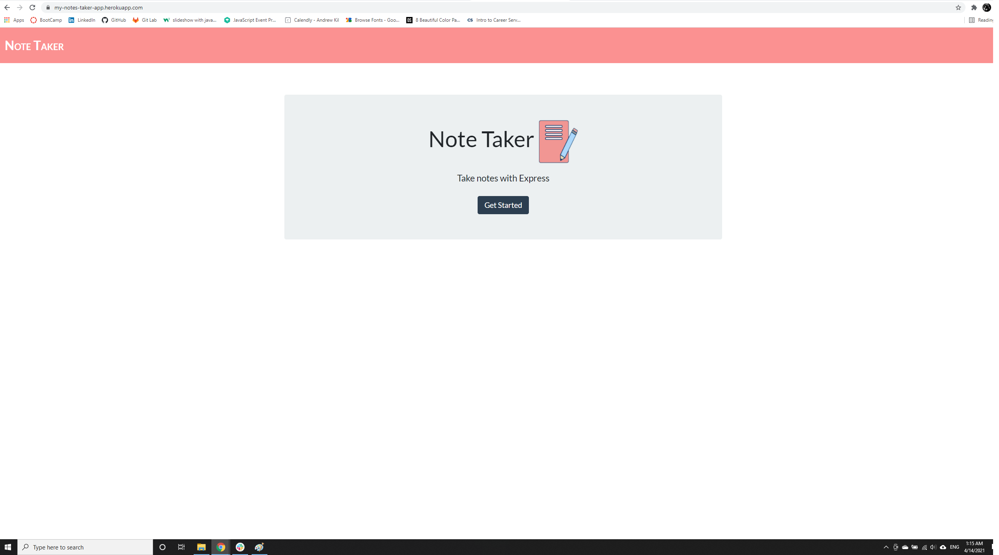

# Note Taker Starter Code

## Description
This is an application for writing and saving notes.

## Languages
JavaScript, HTML, CSS, ES6, Node.js, express.js.

## Table of Contents
* [Installation](#Installation)
* [Usage](#Usage)
* [License](#License)
* [Contributing](#Contributing)
* [Tests](#Tests)
* [Screenshot](#Screenshot)
* [Questions](#Questions)

### Installation
Inorder to install the necessary dependencies, run the following command in your terminal.

```npm install```

### Usage
After installing all the dependencies, run ```node server.js``` in your terminal. The webpage is deployed at [Heroku-webpage](https://my-notes-taker-app.herokuapp.com/).

### License
This application is covered under the following license. For more information on license's conditions, permissions and limitations please visit [here](https://choosealicense.com/licenses/) 

**MIT**

### Contributing 
No contributions at the moment. If anyone wishes to provide contributions, please contact the author.

### Tests
Inorder to test, run the following command in your terminal. Please note that this test requires jest to be installed as dev dependency.

```npm test```

### Screenshot

### Questions
If you have any questions, please reach out to the<br>
Author: Janarthani V S <br>
Email 📧: janarthani.vs@gmail.com <br>
Author's github profile: [GitHub](https://github.com/vsjanarthani)
